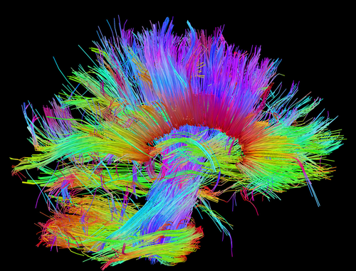
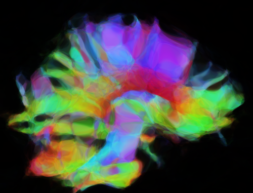

# Command-Line CPPN Tool

Generate and train CPPN images in a variety of ways.


## Setup/Installation

**From source**

```
git clone https://github.com/silky/cppn-cli.git
cd cppn-cli
```

Set up some kind of Python environment ...

```
conda create -n cppn-cli python=3
```

Install

```
python setup.py install
```

Done! The executable named `cppn` should now be on your path.


## Usage

See `cppn --help` and sub-commands for more detail.


### Example 1 - Random new CPPN

```
cppn new \
       --net_size 10 \
       --z_dim 3 \
       --activations tanh,relu \
       --colours 3 \
       --out images/example.png \
       generate \
       --width 500 \
       --height 500
```

Produced:


### Example 2 - Match a given image

Given the following image named `images/ext/colour1.png`:



Then:

```
cppn new \
       --net_size 200 \
       --z_dim 10 \
       --activations tanh,tanh,tanh,tanh,tanh,tanh \
       --colours 3 \
       --out images/matched-colour1.png \
       match \
       --image images/ext/colour1.png --steps 10000
```

Produces:




---

#### Some good models

Found via `hyper-opt`.

With: `max_iter = 10, steps=500`

```
net_size = 41
z_dim = 2
activations = tanh*9
lr = 0.01
```

With: `max_ier = 50, steps=500`

```
--net_size 49 
--z_dim 2 
--activations relu,tanh,relu,tanh 
--steps 2000 
--lr 0.01
```
